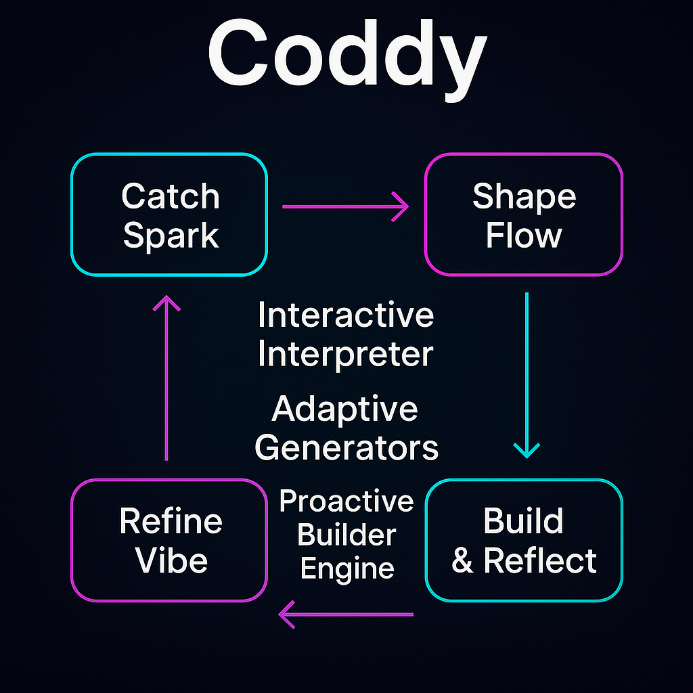

> **Coddy is your async-native, memory-rich dev companion built for creative chaos.**  
> Born from the art of "Vibe Coding: Refined Flow," Coddy transforms spontaneous sparks into structured, high-quality code—without ever sacrificing intuition.  
> This isn’t about building faster. It’s about building smarter, smoother, and more *you*.

# 🚀 Coddy: The Sentient Loop (Async to the Bone)

*My Dev Companion, Reimagined.*

Coddy is the evolution of my intuitive, high-flow process—**Vibe Coding: Refined Flow**. It’s more than an AI assistant—**it’s my co-architect**, designed to translate sparks into software with structure, spontaneity, and soul.

---

## 📚 Table of Contents
- [Philosophy](#-philosophy-async-to-the-bone)
- [The Coddy Flow](#-the-coddy-flow)
- [Roadmap Highlights](#-roadmap-highlights)
- [Task Breakdown](#-task-breakdown-coddy-by-design)
- [Visual Pulse](#-visual-pulse)
- [Tech Stack](#-tech-stack)
- [When to Use Coddy](#-when-to-use-coddy)
- [Getting Started](#-getting-started)
- [The Vibe Button](#-the-vibe-button)
- [License](#-license)

---

## 🧠 Philosophy: Async to the Bone
- **MERN-native**: Built on MongoDB, Express.js, React, Node.js—async-first from the start.  
- **Chaos-aware & Memory-rich**: Coddy learns my patterns and adapts to my rhythm.  
- **CLI to Cloud**: My context flows freely, terminal to UI, without friction.  
- **Vibe > Convention**: Fluid intuition triumphs over rigid scaffolding.  
- **Improvise > Optimize**: Coddy helps me find the “aha!” faster.

---

## 🌀 The Coddy Flow  
> *Every spark deserves structure, without sacrificing serendipity.*

1. **Catch the Spark** – Feed Coddy raw ideas; let it ask the right questions.  
2. **Rapidfire Brainstorm** – Explore bold ideas with the IdeaSynthesizer.  
3. **Shape the Living README** – Breathe life into docs with the Vibe Button.  
4. **Phase It Down** – Use visual roadmaps & the Vibe Cockpit to track flow.  
5. **Code Like I Mean It** – Start anywhere; Coddy scaffolds intelligently.  
6. **Micro-Reflect** – Stay aligned via the Sanity Checker for Project Alignment.  
7. **Teach the Rhythm** – Coddy learns your style, tone, and even inside jokes.  
8. **Document Just-in-Time** – Inline stubs and quick updates keep momentum.

---

## 🛠️ Roadmap Highlights

Coddy evolves in 28 modular phases—from async core to Genesis creation:

- **Phase 0–2**: Philosophy, CLI, Memory Engine  
- **Phase 3–5**: Creative Ideation, UI Shell, Personalization  
- **Phase 6–10**: Git Awareness, Refactoring, Self-Improvement  
- **Phase 11–15**: Collaboration, Service Architecture, Deep Tuning  
- **Phase 16–20**: Dashboard Cockpit, LLM Switching, Proactive Learning  
- **Phase 21–25**: Genesis Mode (Project From Idea)  
- **Phase 26**: Experimental Playground  
- **Phase 27**: Final Review + Evolution

---

## 🧩 Task Breakdown: Coddy by Design

Each phase isn’t just a feature—it's a reflection of how I *work best*:

- **Phase 1: Async MERN Foundation** – Coddy’s backbone, built for responsiveness.  
- **Phase 2: Intelligent Memory & Planning** – Adaptive recall that learns *my* project rhythms.  
- **Phase 3: Creative Ideation** – IdeaSynthesizer ignites and expands my sparks.  
- **Phase 4: Stub Auto-Generator** – Docs align to flow, not the other way around.  
- **Phases 7 & 16: Interactive UI & Real-Time Context** – A cockpit that scales with me.  
- **Phase 8: Code Generation & Refactor** – Scaffolds code as I riff.  
- **Phase 10: Self-Improvement Loop** – Coddy audits itself like a code distiller.  
- **Phase 15: Personalization Engine v2.0** – Gets weird like I do.  
- **Phase 18: Visual Cockpit** – Stay aligned, stay flowing.  
- **Phase 19: Universal LLM Connector** – Brain-flexible, model-agnostic.  
- **Phases 21–25: Genesis Experience** – Spark → Roadmap → Product.  
- **Phase 26: Experimental Playground** – Where Coddy evolves with me.

---

## 🔭 Visual Pulse

Coddy evolves as a recursive loop—philosophy guides action, action refines philosophy. Here's the dev loop:

Each segment represents a distinct feedback loop:

- **Genesis (Phases 21–25)** – From spark to scaffolded repo.  
- **Dashboard (Phases 16–18)** – Creative flow meets system awareness.  
- **Refinement (Phases 4–10)** – Coddy improves as you do.  
- **Experimental Playground (Phase 26)** – Exploratory magic and sanity checks.  
- **You ↔ Coddy** – Feedback and vibe tune the loop.

Want a live diagram? Coddy will build it for you.

---

## 🛠 Tech Stack
- **Backend**: Node.js, Express.js  
- **Frontend**: React  
- **Database**: MongoDB  
- **Language Models**: Gemini, Ollama (modular)  
- **Infrastructure**: Docker-ready, CLI-first, Cloud-optional  
- **UI**: Terminal-style CLI, evolving Vibe Cockpit dashboard

---

## 💡 When to Use Coddy
- You code by feel and need flow-first scaffolding.  
- You want roadmap + docs shaped by intuition, not obligation.  
- You wish your tools *knew you back*.

---

## 🚀 Getting Started

> *Coming soon.*  
Coddy will install in one line. Then: run, riff, build from the vibe outward.

---

## 🌌 The Vibe Button

A spontaneous trigger to reshape docs, prompt new ideas, or re-align the project’s pulse—because flow shouldn’t ask permission.

---

## 📖 License

[To be added – open to discussion]

---

> _“Coddy isn’t just about finishing projects. It’s about making the journey feel like you again.”_ – *James The Giblet*